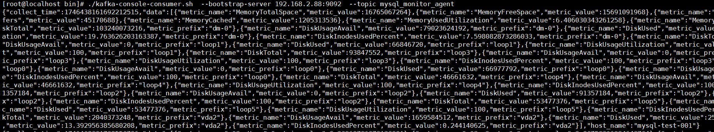

## jammy-cloud-database

-----------------------
**jammy-cloud-database** 是一个云计算项目，主要提供RDS数据库的生命周期管理，包含数据库实例创建，删除，参数管理，备份管理等。
提供自动运维能力，支持一键部署、监控告警、日志管理等功能，使用者只需专注于自身业务。同时支持SQL审计，备份恢复及高可用等特性。

**组件说明：**
- example主要为代码使用示例，包含对数据库节点容器的操作以及对数据库生命周期api的调用等
- mysql-instance-management 主要为mysql实例管理
- rds-api api接口层
- mysql-monitor-agent 主要为数据库代理，安装在节点容器中，负责数据库指标监控，上报，执行各种生命周期管理的相关操作

-------------------------
**支持的数据库：**
- mysql
- postgresql
- sqlserver
-------------------------
**容器底座：**

本项目使用lxd作为RDS数据库节点容器，相比较传统的虚拟机有更小的开销，同时对比docker及containerd等容器，提供更好的隔离性

-------------------------
**技术栈：**
- 开发语言：golang
- 微服务框架：dubbo-go
- web框架：gin
- 中间件：zookeeper/kafka
- 对象存储：minio

--------------------------
**mysql-monitor-agent监控项目：**

- cpu利用率
- 内存利用率
- 硬盘使用量
- 网络接受流量（容器级别）
- 网络发送流量（容器级别）
- 网络流量 （数据库级别）
- 实例每秒SQL语句执行数
- 每秒事务数
- 实例连接数
- InnoDB 读写量
- InnoDB 缓存池命中率
- 实例每秒IO次数
- 慢查询（查询时间超过long_qurey_time秒的查询个数）

